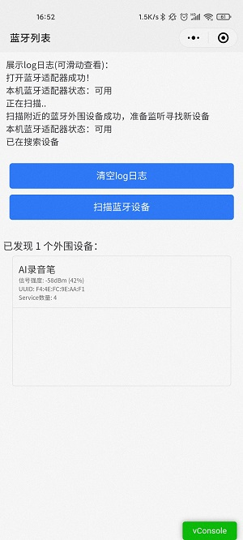
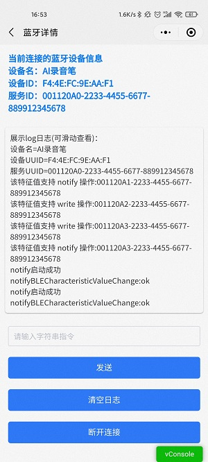

# 基于uni-app 开发的蓝牙调试工具

#### Description
蓝牙调试工具

#### 一：开发文档

1.  [uni-app 蓝牙开发文档](https://uniapp.dcloud.io/api/system/bluetooth)
2.  [uni-app BLE蓝牙开发文档](https://uniapp.dcloud.io/api/system/ble)

#### 二：简述
1. 由于网上关于uni 蓝牙文档资料较少，且大多数不齐全，且大多数只是固定针对某个蓝牙开发的Demo,所以本人查阅网上资料开发的一个调试工具，（ 源码中有详细注释 ）。
### 三: 效果预览

#### 四：兼容版本
安卓手机：Android4.3以上、微信APP客户端6.5.7以上；
苹果手机：iPhone4s以上并且系统要求ios6以上、微信APP客户端6.5.6以上；

#### 五：开发流程
* 判断系统是否支持蓝牙BLE
* 初始化蓝牙适配器
* 扫描附近蓝牙设备
* 连接低功耗蓝牙，连接成功获取对应的服务UUID
* 关闭扫描蓝牙功能
* 获取服务UUID、读写和监听的特征值的UUID
* 进行读或写操作，监听接收数据
* 断开连接连接
* 关闭蓝牙

#### 四：参考资料
[小程序蓝牙BLE调试工具上线了](https://github.com/RAOE/BlueToothTool)
[聊聊JS的二进制家族 Blob、ArrayBuffer和Buffer](https://zhuanlan.zhihu.com/p/97768916)
